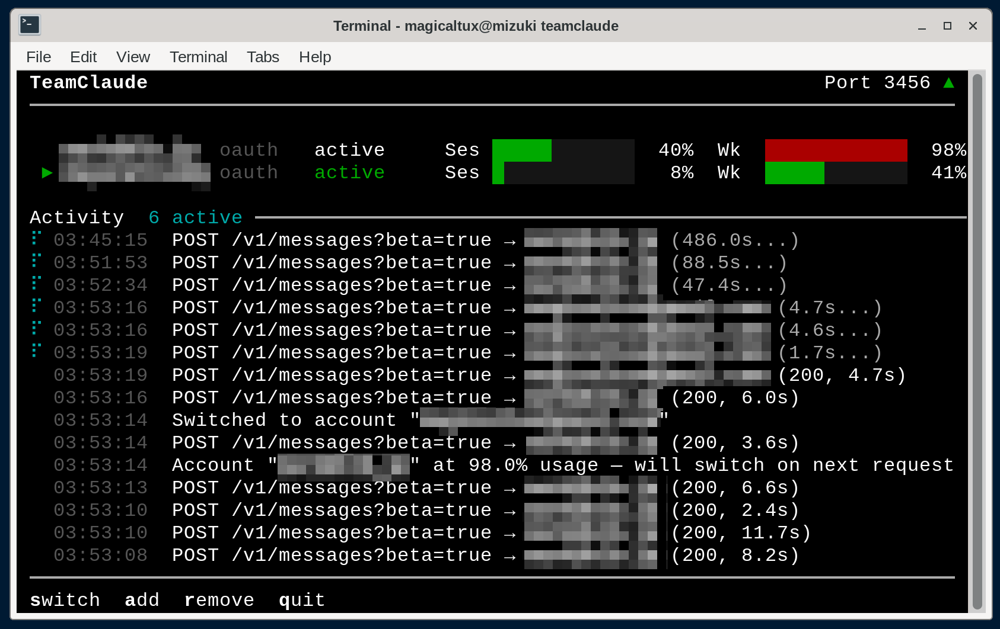

# TeamClaude

Multi-account Claude proxy with automatic quota-based rotation for [Claude Code](https://claude.ai/claude-code).

Sits transparently between Claude Code and the Anthropic API, managing multiple Claude Max accounts and automatically switching when one approaches its session or weekly quota limit.



## Features

- **Automatic account rotation** — switches to the next account when session (5h) or weekly (7d) quota reaches the configured threshold (default 98%)
- **Auto-retry on 429** — if an account is rate-limited, transparently retries with the next one
- **Interactive TUI** — real-time dashboard with color-coded quota bars showing reset countdowns, activity log, and keyboard controls
- **OAuth token refresh** — proactively refreshes expiring tokens, intercepts client token renewals, and persists them to config
- **Hot-reload accounts** — add accounts via `import` or `login` while the server is running, press **R** to pick them up
- **Request logging** — optional full request/response logging for debugging
- **Zero dependencies** — uses only Node.js built-in modules

## Quick Start

Requires Node.js 18+.

```bash
# Install
npm install -g @karpeleslab/teamclaude

# Add your first account (opens browser for OAuth)
teamclaude login

# Add a second account
teamclaude login

# Start the proxy
teamclaude server

# In another terminal, run Claude Code through the proxy
teamclaude run
```

You can also import existing Claude Code credentials instead of logging in:

```bash
claude /login           # Log into an account in Claude Code
teamclaude import       # Import its credentials
```

## Adding Accounts

### OAuth Login (recommended)

The easiest way to add accounts — opens your browser for authentication:

```bash
teamclaude login
```

Uses the same OAuth flow as Claude Code. Auto-detects the account email and subscription tier. Logging in with the same account again updates its credentials.

You can add accounts while the server is running — press **R** in the TUI to reload.

### Import from Claude Code

If you already have Claude Code set up, you can import its credentials directly:

```bash
claude /login           # Log into an account in Claude Code
teamclaude import       # Import its credentials
```

Re-importing the same account updates its credentials.

### API Key

For Anthropic API key accounts (billed via Console):

```bash
teamclaude login --api
```

## Usage

### Start the proxy server

```bash
teamclaude server
```

When running from a TTY, shows an interactive TUI with:
- Account table with session/weekly quota progress bars
- Real-time activity log with request tracking
- Keyboard shortcuts: **s**witch, **a**dd, **r**emove, **R**eload, **q**uit

Falls back to plain log output when not a TTY (e.g. running as a service).

### Run Claude Code through the proxy

```bash
teamclaude run
```

Or manually set the environment:

```bash
eval $(teamclaude env)
claude
```

### Other commands

```bash
teamclaude accounts          # List accounts with live profile info
teamclaude status            # Show live proxy status (requires running server)
teamclaude remove <name>     # Remove an account
teamclaude api <path>        # Call an API endpoint with account credentials
teamclaude help              # Show all commands
```

### Request logging

Log full request/response details to a directory (one file per request):

```bash
teamclaude server --log-to /tmp/requests
```

## Configuration

Config is stored at `~/.config/teamclaude.json` (or `$XDG_CONFIG_HOME/teamclaude.json`). A random proxy API key is generated on first use.

Override the config path with `TEAMCLAUDE_CONFIG`:

```bash
TEAMCLAUDE_CONFIG=./my-config.json teamclaude server
```

### Config format

```json
{
  "proxy": {
    "port": 3456,
    "apiKey": "tc-auto-generated-key"
  },
  "upstream": "https://api.anthropic.com",
  "switchThreshold": 0.98,
  "accounts": [
    {
      "name": "user@example.com",
      "type": "oauth",
      "accountUuid": "...",
      "accessToken": "sk-ant-oat01-...",
      "refreshToken": "sk-ant-ort01-...",
      "expiresAt": 1774384968427
    }
  ]
}
```

## How It Works

1. Claude Code connects to the local proxy instead of `api.anthropic.com`
2. The proxy selects the active account and forwards requests with that account's credentials
3. Rate limit headers from the API (`anthropic-ratelimit-unified-*`) track session and weekly quota
4. When usage reaches the threshold, the proxy switches to the next available account
5. If all accounts are exhausted, returns 429 with the soonest reset time

## License

MIT
